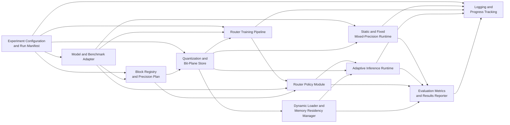

# High-Level Design

## Overview

QAQ is a research prototype for query-adaptive mixed-precision LLM inference. For each input query, the system selects block-level precision, reconstructs the required quantized weights from bit-plane artifacts, and optionally materializes only selected bit-planes from CPU memory into GPU memory.

The design is paper-first. `QAQ.pdf` is the primary source for the architecture: bit-plane decomposition, a lightweight trainable router, block-wise mixed-precision inference, and an on-demand CPU-to-GPU loader. The official QAQ code is private and unavailable, and `QAQ.pdf` is the only supplementary material available to this rebuild. `doc/proposal.md`, `doc/problem-brief.md`, and `doc/requirements.md` refine the rebuild scope, local hardware assumptions, evaluation modes, and acceptance expectations. `doc/repo-map.md` and `doc/quality-gates.md` are not present, so this HLD defines module boundaries without relying on existing implementation structure.

The first implementation target is LLaMA-3.1-8B on a configurable subset of the available 8 NVIDIA GeForce RTX 3090 GPUs. Full paper-aligned reproduction remains broader: Qwen3-4B, Qwen3-8B, and LLaMA-3.1-8B across HellaSwag, PIQA, ARC-E, ARC-C, WinoGrande, WikiText-2, and PTB.

## Goals

- Rebuild the core QAQ behavior from `QAQ.pdf`: bit-plane weight representation, trainable query-conditioned routing, block-wise mixed precision, and optional on-demand loading.
- Support the required comparison modes: full FP16, static 8-bit, static 4-bit, QAQ on-demand off, and QAQ on-demand on.
- Preserve the paper's central trade-off surface by reporting accuracy or benchmark score, perplexity where applicable, end-to-end latency, GPU memory, routing summaries, and loader activity.
- Provide a staged architecture that validates static baselines, bit-plane reconstruction, fixed mixed-precision execution, router behavior, adaptive inference, and dynamic loading independently.
- Produce durable training and inference logs, progress tracking, run manifests, and machine-readable result artifacts sufficient for later reports and detailed design.

## Non-Goals

- Production-grade model serving, scheduling, autoscaling, or API service design.
- Training or fine-tuning a new base LLM from scratch.
- Guaranteeing exact reproduction of every paper number before missing implementation details are resolved.
- Supporting every model family during the first milestone.
- Building a UI or dashboard.
- Inventing unrelated quantization algorithms beyond what is needed to reproduce and evaluate QAQ behavior.
- Implementing asynchronous prefetching or advanced memory scheduling before basic adaptive quantization and synchronous on-demand loading are validated.

## Requirements Summary

| Area | Confirmed requirement | Source |
| --- | --- | --- |
| Precision adaptation | Precision selection must be query-dependent rather than a static uniform policy. | `QAQ.pdf` Section 2; `doc/proposal.md` Problem Summary; `doc/requirements.md` Functional Requirements |
| Bit-plane storage | Quantized weights must be decomposed into bit-planes up to maximum bit-width `B`, with 8 used as the paper example. Lower precision uses the most significant bit-planes. | `QAQ.pdf` Section 2; `doc/requirements.md` Functional Requirements |
| Router | A lightweight trainable router computes block/query-dependent scores or probabilities over candidate bit-widths. | `QAQ.pdf` Section 2; `doc/proposal.md` Algorithm Strategy |
| Router training | Router training uses a full-precision teacher, quantized student, and knowledge distillation; base LLM parameters are frozen. | `QAQ.pdf` Figure 1; `doc/requirements.md` Functional Requirements |
| Block granularity | Transformer structure is controlled at block level, with MHA and FFN shown in the paper figure. | `QAQ.pdf` Figure 1; `doc/requirements.md` Functional Requirements |
| Runtime modes | The system must support adaptive QAQ with on-demand loading disabled and enabled. | `QAQ.pdf` Table 1; `doc/proposal.md` Proposed Approach |
| Dynamic loading | On-demand mode transfers only router-selected bit-planes or precision variants from CPU memory into GPU memory. | `QAQ.pdf` Section 2; `doc/requirements.md` Functional Requirements |
| Evaluation | Required modes are full FP16, static 8-bit, static 4-bit, QAQ on-demand off, and QAQ on-demand on. | `QAQ.pdf` Table 1; `doc/requirements.md` Acceptance Criteria |
| Metrics | Report benchmark score or perplexity, latency, and GPU memory for every evaluated mode. | `QAQ.pdf` Table 1; `doc/problem-brief.md` Success Metrics |
| Hardware | First milestone targets LLaMA-3.1-8B and does not need all 8 RTX 3090 GPUs. GPU selection must be configurable. | `doc/requirements.md` Non-Functional Requirements |
| Observability | Training and inference need terminal progress plus durable logs. Logs must not distort timing-sensitive latency metrics. | `doc/requirements.md` Non-Functional Requirements and Output Format |

## Proposed Architecture

The system is organized around a reproducible experiment pipeline with separable preparation, training, runtime, loading, and evaluation responsibilities.

The architecture separates QAQ's algorithmic behavior from evaluation and observability:

- Static and fixed mixed-precision modes provide correctness anchors before learned routing is trusted.
- The router policy is distinct from router training so evaluation can load a trained checkpoint, an explicit diagnostic router, or fail cleanly if no valid router is configured.
- The adaptive runtime is distinct from the dynamic loader so QAQ on-demand off can evaluate routing behavior without CPU-to-GPU transfer overhead.
- Evaluation consumes outputs from all runtime modes through one reporting path to keep metrics comparable.

## Modules

| Module | Responsibility | Inputs | Outputs | Owned data | Dependencies | Externally visible behavior | Source traceability |
| --- | --- | --- | --- | --- | --- | --- | --- |
| Experiment Configuration and Run Manifest | Validate and freeze run settings: model, tokenizer, dataset, mode, precision candidates, block granularity, selected GPUs, seed, logging, checkpoint, and output paths. | User config, CLI overrides if provided, environment and hardware discovery. | Validated run plan, immutable run manifest, early configuration errors. | Config schema, resolved run metadata, selected device list. | None; foundation for other modules. | Fails before model loading on invalid settings; records enough metadata to reproduce a run. | `doc/proposal.md` Module Candidates; `doc/requirements.md` Input Format, Output Format, Error Behavior |
| Model and Benchmark Adapter | Load the pretrained causal LLM and tokenizer, expose forward execution, hidden-state access, and benchmark prompt/tokenization behavior. | Model ID or path, tokenizer ID or path, dataset examples, device placement. | Model execution handle, tokenized batches, hidden representations, logits or losses. | Model/tokenizer references and benchmark adapter metadata; base LLM parameters remain frozen for router training. | Experiment Configuration, Block Registry. | Supports FP16 teacher/reference execution and benchmark-compatible inference. | `QAQ.pdf` Sections 2-3; `doc/requirements.md` Functional Requirements |
| Block Registry and Precision Plan | Map model structure into QAQ-controlled blocks, primarily MHA and FFN blocks; assign stable block IDs; validate precision candidates and fixed/adaptive profiles. | Model architecture metadata, candidate bit-widths, fixed profiles, router decisions. | Per-block metadata and precision plan for each runtime step. | Block IDs, granularity metadata, precision validation rules. | Model and Benchmark Adapter, Router Policy Module. | Rejects unsupported layer layouts or invalid bit-widths rather than silently falling back to full precision. | `QAQ.pdf` Figure 1; `doc/requirements.md` Functional Requirements and Edge Cases |
| Quantization and Bit-Plane Store | Create or load quantized bit-plane artifacts; reconstruct weights for requested effective bit-widths; validate static-equivalent reconstruction. | Full-precision weights, block metadata, maximum bit-width `B`, requested bit-width, artifact paths. | Bit-plane artifacts, reconstructed block weights, validation summaries. | Bit-plane tensors and metadata mapping blocks to available bit-widths. | Experiment Configuration, Block Registry. | Enables static 4-bit, static 8-bit, and adaptive mixed-precision weight materialization from one representation. | `QAQ.pdf` Bit-Plane Decomposition; `doc/proposal.md` Algorithm Strategy |
| Static and Fixed Mixed-Precision Runtime | Run full FP16, static 8-bit, static 4-bit, and fixed mixed-precision profiles without learned routing. | Model, tokenizer, bit-plane store, fixed precision profile, benchmark input. | Predictions, logits or losses, latency samples, memory samples, baseline metrics. | Baseline run records and static-equivalent validation outputs. | Model and Benchmark Adapter, Quantization and Bit-Plane Store, Evaluation Metrics. | Provides comparison anchors and verifies that static-equivalent QAQ paths match static baselines within tolerance. | `doc/proposal.md` Stages 1-3; `doc/requirements.md` Acceptance Criteria |
| Router Policy Module | Compute query- and block-dependent precision scores from hidden representations; normalize over candidate bit-widths; convert probabilities to precision decisions; record routing summaries. | Query inputs, block hidden representations `h_j(x)`, candidate bit-widths, temperature, router checkpoint. | Per-block probabilities, discrete precision decisions, routing trace summaries. | Router parameters, routing metadata, decision conversion policy. | Model and Benchmark Adapter, Block Registry, Experiment Configuration. | Produces query-dependent and block-specific routing; flags constant global precision behavior during evaluation. | `QAQ.pdf` Trainable Router; `doc/requirements.md` Functional Requirements and Edge Cases |
| Router Training Pipeline | Train the router while keeping base LLM parameters frozen, using full-precision teacher and quantized student signals with knowledge distillation. | Training or calibration data, teacher outputs, student outputs, router config, bit-plane artifacts. | Router checkpoint, training metrics, durable progress logs, incomplete-run markers on failure. | Router training state, checkpoint metadata, training logs. | Model and Benchmark Adapter, Quantization and Bit-Plane Store, Router Policy Module, Logging. | Fails clearly if no concrete router-training method is selected; records losses, progress, checkpoints, and assumptions. | `QAQ.pdf` Figure 1 and Trainable Router; `doc/requirements.md` Functional Requirements |
| Adaptive Inference Runtime | Execute QAQ inference per query: gather router features, request precision decisions, materialize selected precision per block, run block-wise mixed-precision inference, and emit traces. | Tokenized query, router checkpoint, bit-plane store, runtime mode, block metadata. | Predictions, logits or losses, per-query precision plans, latency and memory events. | Active precision plan and per-query adaptive trace. | Router Policy Module, Quantization and Bit-Plane Store, Dynamic Loader, Evaluation Metrics. | Supports QAQ on-demand off and QAQ on-demand on using the same routing semantics. | `QAQ.pdf` Block-wise Quantization Inference; `doc/proposal.md` Stages 5-6 |
| Dynamic Loader and Memory Residency Manager | Keep bit-plane artifacts CPU-resident when configured, load selected bit-planes to GPU on demand, offload or release inactive planes, and measure transfer behavior. | Router-selected block/bit-width requests, CPU-resident bit-plane store, selected GPU IDs, residency policy. | GPU-resident weight subset, transfer timings, memory residency map, loader warnings. | Residency metadata, loader timing summaries, active GPU cache state. | Quantization and Bit-Plane Store, Adaptive Inference Runtime, Logging. | In on-demand mode, exposes the expected trade-off: lower peak GPU memory with higher latency from synchronous transfers. | `QAQ.pdf` On-Demand Loading Mechanism and Table 1; `doc/problem-brief.md` Risks |
| Evaluation Metrics and Results Reporter | Run benchmark comparisons and aggregate accuracy, perplexity, latency, peak GPU memory, routing summaries, and loader summaries across modes. | Runtime outputs, benchmark labels, timing events, memory events, routing traces, run manifest. | Machine-readable result artifacts, comparison tables, incomplete-run markers, human-readable summaries. | Result schema, metric aggregation rules, report metadata. | Static Runtime, Adaptive Runtime, Router Policy Module, Dynamic Loader. | Reports all required modes on common model, dataset, prompt, tokenizer, and metric settings. | `QAQ.pdf` Results; `doc/requirements.md` Output Format and Acceptance Criteria |
| Logging and Progress Tracking | Provide terminal progress and durable logs for training, inference, evaluation, loader events, warnings, and failures. | Progress events, metrics events, checkpoint events, errors, run manifest. | Train logs, inference logs, evaluation logs, status markers. | Log files, progress counters, failure status metadata. | All long-running modules. | Makes long-running runs auditable without materially distorting measured latency. | `doc/requirements.md` Non-Functional Requirements, Output Format, Error Behavior |

## Module Relationships

| Type | Source | Target | Direction and ownership | Data or contract | Confirmed source fact |
| --- | --- | --- | --- | --- | --- |
| Configuration dependency | Experiment Configuration | All runtime, training, evaluation, and logging modules | Configuration owns validation and immutable run manifest; consumers must not reinterpret missing fields silently. | Validated config and run manifest. | `doc/requirements.md` Input Format and Error Behavior |
| Ownership | Block Registry | Quantization and Bit-Plane Store | Block Registry owns block IDs and granularity; Bit-Plane Store maps artifacts to those IDs. | Block metadata and available bit-width metadata. | `QAQ.pdf` Figure 1; `doc/requirements.md` Functional Requirements |
| Data flow | Model and Benchmark Adapter | Router Policy Module | Model Adapter exposes hidden representation `h_j(x)`; Router consumes it for block `j`. | Hidden features, candidate bit-widths, temperature. | `QAQ.pdf` Equation 2 |
| Data flow | Router Policy Module | Adaptive Inference Runtime | Router owns probability and decision semantics; Adaptive Runtime applies resulting precision plans. | Per-block precision probabilities and decisions. | `QAQ.pdf` Equations 3-4 |
| Data flow | Quantization and Bit-Plane Store | Static and Fixed Mixed-Precision Runtime | Store reconstructs requested static or fixed profile weights; runtime executes them. | Reconstructed block weights and static precision profiles. | `doc/proposal.md` Stages 2-3 |
| Data flow | Quantization and Bit-Plane Store | Adaptive Inference Runtime | Store provides selected reconstructed weights when on-demand loading is disabled. | Selected top-bit-plane reconstruction for each block. | `QAQ.pdf` Bit-Plane Decomposition |
| Data flow | Quantization and Bit-Plane Store | Dynamic Loader | Store provides CPU-resident bit-planes; Loader owns GPU materialization and residency. | Selected bit-plane subset `S_t` and size metadata. | `QAQ.pdf` On-Demand Loading Mechanism |
| Call | Adaptive Inference Runtime | Dynamic Loader | Adaptive Runtime requests selected bit-planes; Loader returns GPU-resident weights or fails clearly. | Load request, residency result, transfer timing. | `QAQ.pdf` Equation 6; `doc/requirements.md` Error Behavior |
| Lifecycle order | Static Runtime | Router Training Pipeline | Static baselines and bit-plane validation should precede router training so student behavior is grounded. | Baseline metrics and validated quantized artifacts. | `doc/proposal.md` Proposed Approach |
| Lifecycle order | Router Training Pipeline | Adaptive Inference Runtime | Adaptive QAQ evaluation uses a trained router checkpoint unless an explicitly labeled diagnostic mode is configured. | Router checkpoint and metadata. | `doc/requirements.md` Error Behavior |
| Evaluator/test dependency | Static Runtime and Adaptive Runtime | Evaluation Metrics and Results Reporter | Evaluation owns metric definitions and comparison rules; runtimes supply raw outputs and timing/memory events. | Scores, losses, latency, memory, routing, loader summaries. | `doc/requirements.md` Acceptance Criteria |
| Evaluator/test dependency | Logging and Progress Tracking | Evaluation Metrics and Results Reporter | Logs provide auditability; metrics reporter references durable artifacts without relying only on stdout. | Log paths, failure status, incomplete markers. | `doc/requirements.md` Output Format |

## Data Flow

### Preparation Flow

1. Experiment Configuration validates the run plan, selected model, candidate bit-widths, block granularity, selected GPU IDs, output directory, logging settings, and mode.
2. Model and Benchmark Adapter loads the tokenizer and base LLM and exposes block metadata to the Block Registry.
3. Block Registry maps transformer structure into controlled blocks. The paper-aligned primary boundary is MHA and FFN blocks.
4. Quantization and Bit-Plane Store decomposes supported block weights into bit-planes up to maximum bit-width `B`, records artifact metadata, and validates that requested bit-widths are available.
5. Static and Fixed Mixed-Precision Runtime validates full FP16, static 8-bit, static 4-bit, and fixed mixed profiles before adaptive routing is treated as a result.

### Router Training Flow

1. Training data or calibration prompts are tokenized by the Model and Benchmark Adapter.
2. The full-precision teacher and quantized student produce training signals while base LLM parameters remain frozen.
3. Router Policy Module consumes block-level hidden representations and produces probabilities over candidate bit-widths.
4. Router Training Pipeline applies the selected knowledge-distillation objective, trains only router parameters, emits durable progress logs, and saves router checkpoints.
5. Training outputs include enough metadata to identify the model, dataset, precision candidates, block granularity, seed, hardware, and unresolved assumptions.

### QAQ Inference Flow: On-Demand Off

1. A query is tokenized and passed through the model path needed to expose router features.
2. Router Policy Module computes per-block precision probabilities and decisions.
3. Adaptive Inference Runtime requests reconstructed block weights from GPU-resident bit-plane artifacts or pre-materialized precision data.
4. The model executes block-wise mixed-precision inference using the selected precision plan.
5. Evaluation Metrics records output quality, latency, peak GPU memory, and routing summaries.

### QAQ Inference Flow: On-Demand On

1. The same routing flow produces per-block precision decisions.
2. Adaptive Inference Runtime requests the selected bit-plane subset from Dynamic Loader.
3. Dynamic Loader materializes only requested bit-planes or reconstructed weights into GPU memory and records transfer timing and residency state.
4. Inference runs after selected weights are available. Synchronous transfer overhead is measured as part of the on-demand result.
5. Evaluation Metrics reports the expected trade-off: lower GPU memory target with higher latency.

## Interfaces and Contracts

### Configuration Contract

The run configuration must identify model, tokenizer, dataset, split or benchmark subset, mode, precision candidates, maximum bit-width `B`, block granularity, device type, selected GPU IDs, seed, router checkpoint when required, logging settings, output directory, and overwrite policy.

Invalid configs fail before expensive model loading. Missing required artifacts, unavailable GPUs, unsupported precision candidates, and unsafe output-directory reuse must produce clear errors.

### Block Contract

Each controlled block must have a stable ID, source module path or model location, block type, supported bit-widths, quantized artifact metadata, and current precision decision. The primary paper-aligned block types are MHA and FFN. Whole-layer granularity remains a documented fallback only if detailed design later proves MHA/FFN-level control infeasible for the first milestone.

### Bit-Plane Artifact Contract

Each artifact must record model identity, block ID, original tensor metadata, maximum bit-width `B`, available bit-planes, quantization parameters, reconstruction policy, artifact version, and validation status. Requests for bit-widths above `B`, non-positive bit-widths, or missing planes fail clearly.

### Router Decision Contract

For each query and block, the router emits probabilities over configured candidate bit-widths plus a deterministic discrete decision policy. Router output must be traceable to the router checkpoint, temperature, candidate set, block ID, and input example identifier. Ties must be resolved deterministically.

### Runtime Mode Contract

Required modes are:

- `fp16`: full-precision teacher/reference inference.
- `static_8bit`: static 8-bit quantized baseline.
- `static_4bit`: static 4-bit quantized baseline.
- `fixed_mixed`: diagnostic mixed precision with routing disabled.
- `qaq_on_demand_off`: adaptive routing active, on-demand CPU-to-GPU loading disabled.
- `qaq_on_demand_on`: adaptive routing active, selected bit-planes loaded from CPU to GPU on demand.

The paper requires comparison of full FP16, static 8-bit, static 4-bit, QAQ on-demand off, and QAQ on-demand on. `fixed_mixed` is a validation mode from the staged proposal, not a paper-result replacement.

### Result Contract

Every result artifact must include model, tokenizer, dataset, split, prompt formatting or benchmark adapter, mode, precision candidates, block granularity, router checkpoint if used, seed, selected GPU IDs, hardware metadata, dependency metadata where available, score or perplexity, latency, peak GPU memory, routing summary, loader summary for on-demand mode, log paths, and completion status.

The canonical machine-readable format is still open. The HLD requires a stable machine-readable artifact but does not choose JSON, JSONL, CSV, or a combination.

### Logging Contract

Training logs must include current step or epoch, loss values, learning rate if applicable, elapsed time, checkpoint events, warnings, and failure status. Inference and evaluation logs must include current benchmark or dataset progress, mode, processed example count, elapsed time, latency summary, memory summary, routing summary, loader summary where applicable, warnings, and failure status.

Timing-sensitive latency metrics must separate measured inference latency from incidental progress/logging overhead where practical.

## Operational Considerations

- GPU selection is configurable. First-milestone acceptance does not require using all 8 RTX 3090 GPUs, but run metadata must identify selected GPU IDs and memory readings.
- CPU-only or small-tensor execution is acceptable for unit tests and smoke checks, but GPU execution is required for claims about QAQ memory and CPU-to-GPU loading behavior.
- Dynamic loading is synchronous in the first design because the paper reports latency overhead from sequential CPU-to-GPU transfers. Asynchronous prefetching is future work.
- Result directories should not be overwritten unless an explicit overwrite setting is provided. Interrupted runs should leave incomplete markers rather than successful-looking partial metrics.
- Benchmark comparisons are valid only when model checkpoint, tokenizer, dataset split, prompt formatting, precision candidates, and metric implementation are shared across modes.
- Warm-up, cache clearing, memory measurement points, and batch/sequence settings must be consistent across modes and recorded in the manifest.
- Static baselines are mandatory. QAQ results must not be presented as valid if static 8-bit or static 4-bit baselines cannot run on the same benchmark settings.

## Testing and Quality Gate Alignment

`doc/quality-gates.md` is not present. Until it exists, quality alignment follows `doc/proposal.md` and `doc/requirements.md`.

Minimum unit and component checks:

- Configuration validation rejects invalid modes, missing artifacts, invalid GPU IDs, unsupported precision candidates, and unsafe output reuse.
- Block Registry maps the target model into stable controlled blocks and rejects unsupported module layouts clearly.
- Bit-plane reconstruction produces expected shapes and numerically plausible lower- and higher-precision reconstructions.
- Static-equivalent bit-plane reconstruction for all-8-bit and all-4-bit profiles matches corresponding static quantized baselines within an agreed tolerance.
- Router Policy Module emits valid probability distributions or deterministic precision choices for every configured block.
- Dynamic Loader reports missing bit-planes, invalid bit-widths, unavailable CUDA transfer support, and insufficient memory as explicit failures.

Minimum integration checks:

- One smoke run executes a prompt or small benchmark path in full FP16, static 8-bit, static 4-bit, fixed mixed precision, QAQ on-demand off, and QAQ on-demand on where hardware permits.
- QAQ routing summaries demonstrate variation by query or block; constant global precision is flagged.
- Training and inference produce durable progress logs and machine-readable metrics.
- Evaluation artifacts include all metadata required to reproduce the run.

Acceptance alignment:

- First milestone targets LLaMA-3.1-8B, at least one held-out evaluation task, all five required comparison modes where hardware permits, durable logs, and routing evidence.
- Classification QAQ accuracy is assumed acceptable within 1 percentage point of static 8-bit until the owner chooses a different threshold.
- Language-modeling QAQ perplexity is assumed acceptable within 5 percent relative of static 8-bit until the owner chooses a different threshold.
- On-demand QAQ should target at least 5 percent lower peak GPU memory than the comparable non-on-demand mode unless the run is explicitly marked as constrained by hardware or framework behavior.

## Risks and Tradeoffs

- Router training is under-specified in the paper. The architecture isolates router training so the concrete loss, dataset, and feature extraction point can be selected and documented before claims are made.
- The paper alternates between describing bit-planes and multiple precision variants. This HLD treats bit-planes as the primary artifact because the paper's equations and local requirements require them, while leaving artifact metadata flexible enough to describe derived precision variants if needed.
- MHA/FFN-level control is paper-aligned but may be harder to integrate than whole-layer control. Whole-layer control is not the primary design, but it remains a documented fallback if implementation feasibility requires a staged simplification.
- Dynamic loading may reduce peak GPU memory while increasing latency substantially. This is an expected trade-off, not a failure, if measured and reported.
- Exact paper-scale reproduction may be blocked by checkpoint access, model licenses, dataset access, dependency support, hardware limits, or the lack of available official code.
- A smaller stand-in model can validate system behavior but must not be labeled as paper reproduction.
- Progress logging is required, but excessive logging can distort latency metrics. Timing-sensitive benchmarks need measured regions that exclude avoidable logging overhead.

## Assumptions

- The user's request to proceed permits documenting unresolved design details as assumptions and open questions instead of blocking HLD generation.
- The first architecture target is a research prototype, not a production service.
- LLaMA-3.1-8B is the first model acceptance target; Qwen3-4B and Qwen3-8B remain full reproduction targets after the first path works.
- The primary controlled block boundary is MHA and FFN because that is how the paper figure presents block-wise quantization.
- Candidate precision starts with source-supported 4-bit and 8-bit behavior. Adding a mid precision such as 6-bit remains open until the precision set is approved.
- Router features are taken at or near each controlled block as `h_j(x)` because the paper defines router scoring from block hidden representations.
- CPU-only and small-model tests are valid for correctness checks, but not for GPU memory or on-demand loading claims.
- Common LLM tooling may be used later if detailed design approves it, but this HLD does not choose a framework.
- Official QAQ code will not be used as an implementation reference because it is private and unavailable.

## Open Questions

1. What exact router-training loss should be used beyond the paper's knowledge-distillation description?
2. Which training or calibration dataset should train the router, and how should it be separated from held-out evaluation data?
3. Should the first QAQ precision candidates be `{4, 8}` or a low/mid/high set such as `{4, 6, 8}`?
4. If MHA/FFN block control is too costly for the first milestone, is whole-layer control acceptable as a temporary simplification?
5. What canonical machine-readable result format should be used: JSON, JSONL, CSV, or a combination?
6. Which external libraries are approved for model loading, quantization, evaluation, and GPU memory measurement?
7. What exact accuracy, perplexity, memory, and latency thresholds define success for the first LLaMA-3.1-8B milestone?
8. How should batching be handled when multiple queries in the same batch receive different precision decisions?
9. Are generation workloads in scope for the first milestone, or should evaluation focus on benchmark scoring and perplexity only?
